# Instalación de CALDERA
Emulación de adversarios utilizando CALDERA

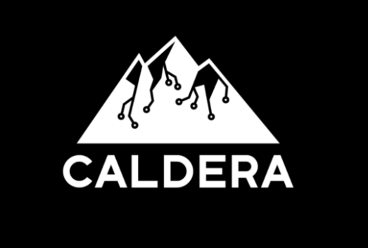

**Escenario**

El objetivo de este laboratorio es aprender la manera de instalar y de utilizar CALDERA, una herramienta que se utilizara para dirigir ataques a gran escala, utilizando ataques muy eficientes, creando nos propio sistema de ataque, todo esto con el fin de mejorar nuestra infraestructura, seguridad de los equipos y utilizado como practica para nuestra defensa dentro de la organización.

**¿Qué es CALDERA?**
Medir aspecto de la seguridad de la red a través de pruebas de ataque, Red team y emulación de adversarios requiere de muchos recursos. CALDERA ofrece un sistema inteligente y automatizado de Red Team que puede reducir la necesidad de recursos que necesitan los equipos de seguridad en sus rutinas de pruebas, liberándolos para afrontar otros problemas críticos.

CALDERA se puede utilizar para probar soluciones de seguridad y evaluar la posición de seguridad de una red frente a las técnicas de ataque utilizadas comúnmente posterior a ser comprometidas y contenidas en los modelos ATT&CK .CALDERA aprovecha el modelo  ATT&CK para identificar y replicar los comportamientos del adversario como si estuviera ocurriendo una intrusión real. Esto permite automatizar susceptibilidad de una red al éxito del adversario, lo que permite a las organizaciones ver sus redes a través de los ojos de una amenaza persistente avanzada bajo demanda de esta manera permite verificar las demandas y las configuraciones de seguridad en función de técnicas de amenazas conocidas. CALDERA utiliza un lenguaje de representación del adversario, el perfil ATT&CK, un motor de decisiones para procesar el conocimiento recopilado y elegir acciones posteriores, y un agente para realizar la operación. El uso de CALDERA puede reducir los recursos necesarios para las evaluaciones y permitir que los equipos rojos se concentren en soluciones sofisticadas para problemas más difíciles. También permitirá a las organizaciones ajustar más rápidamente los sistemas de detección de intrusos basados en el comportamiento a medida que se implementan.

CALDERA es complementario a otras formas de evaluación de la seguridad. La postura de seguridad de una red se evalúa comúnmente en función de los niveles de parches de softwares, los controles de seguridad y las herramientas de defensa. Si bien muchas herramientas de detección de intrusos se basan en la búsqueda de indicadores de amenazas conocidos que cambian con frecuencia, las evaluaciones y la detección de adversarios rara vez se basan en el comportamiento del adversario. Esto deja a los defensores adivinando cómo detectarían y responderían a las amenazas activas. CALDERA ayuda a los defensores a ir más allá de la detección de indicadores de compromiso a la detección y respuesta del comportamiento del adversario.

**Objetivos del Laboratorio**
El objetivo de este laboratorio es demostrar:
* Demostrar cómo se instala CALDERA
* Demostrar cómo se utiliza CALDERA
* Mostrar que podemos hacer utilizando CALDERA

**Requerimientos del Laboratorio**
Para desarrollar debemos:
* Maquina Linux (Preferible virtual para poder practicar la instalación)
* Mantener nuestra máquina virtual actualizada
* Tener Python instalado en nuestra maquina

Duración del laboratorio: 30 minutos

# 1. ¿Como Se instala CALDERA Mitre?

### Paso 1 - Instalar CALDERA

El primer paso que necesitamos realizar es actualizar nuestro equipo, esto lo realizamos con el siguiente comando:
```
Sudo apt-get update && apt-get upgrade -y
```
Luego de actualizar nuestra maquina podemos instalar CALDERA desde girhub con el comando: (el cual podemos copiar)

```
git clone https://github.com/mitre/caldera.git --recursive --branch 3.0.0
```
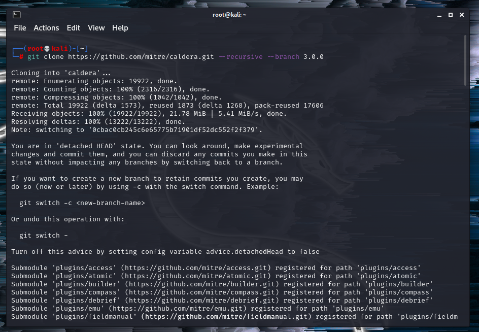

### Paso 2 - Ir a la carpeta CALDERA

Para iniciar, con el comando __ls__ podremos listar los archivos dentro de la carpeta donde nos encontremos, y con el comando __cd__ podremos ingresar o cambiarnos de carpeta.
Para este paso ingresaremos con __cd__ donde se encuentra CALDERA. Una vez dentro de la carpeta de CALDERA volveremos a colocar el comando __ls__ para ver los archivos contenidos en esta carpeta. **(Utilizo el comando _pwd_ para saber en qué carpeta me encuentro)**

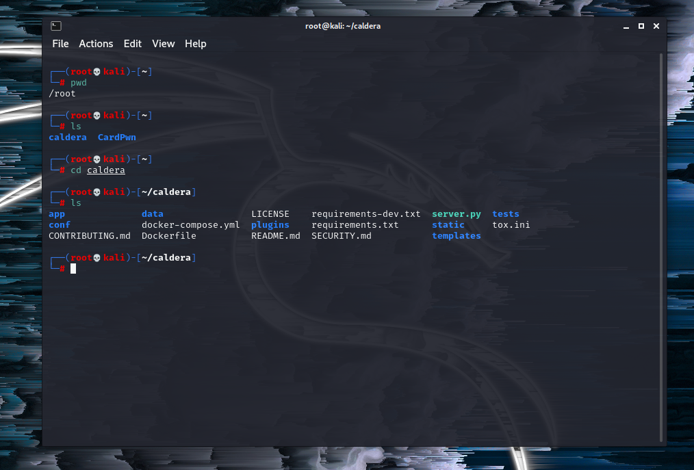

### Paso 3 - Instalación de Requerimientos

**Nota**: para realizar este comando debemos tener previamente instalado python3, pero mediante el comando
**sudo apt install python** y **sudo apt install python3-pip** lo podemos obtener.
```
sudo apt install python3
```
```
sudo apt install python3-pip
```
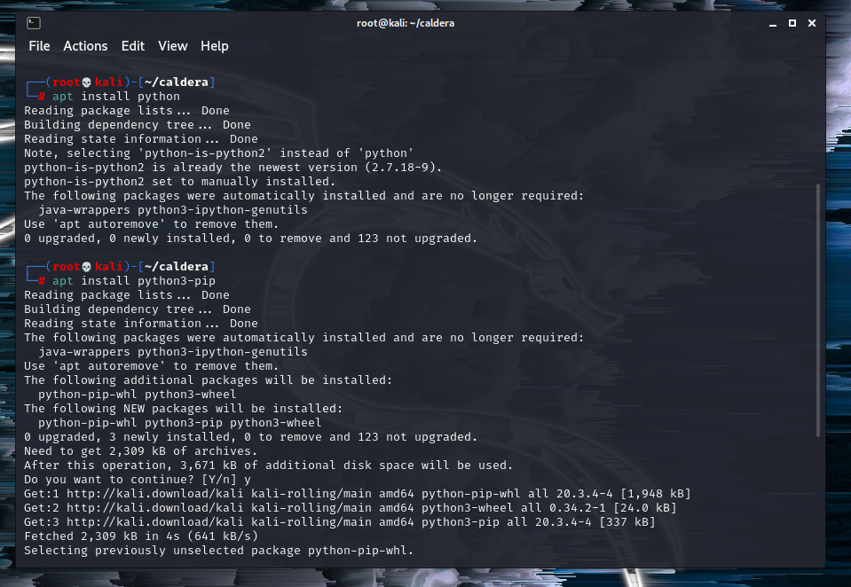

Usando el comando **pip3 install -r requirements.txt** instalamos los requisitos necesarios para CALDERA.
```
pip3 install -r requirements.txt
```

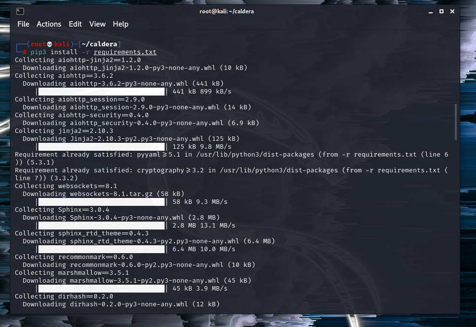

### Paso 4 - Iniciar CALDERA

Usando el comando 
```
python3 server.py --insecure
```
iniciamos el servicio CALDERA para poder usarlo.

* Nota: si cerramos la pestaña el servicio se apagará, por lo que es conveniente no tener interacción con esta pestaña.

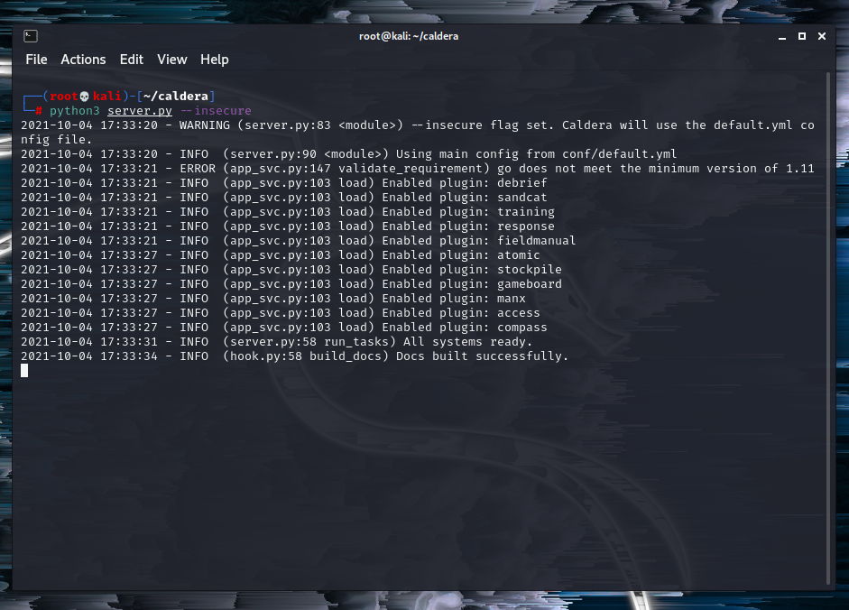

### *Nota (error versión de golang)*
Si al momento de iniciar el servicio de caldera aparece el siguiente error **(go does not meet the minumun version of 1.11)** por favor seguir los siguientes comandos para instalar/actualizar la versión de **golang**:
* Descargar la última versión de go : https://golang.org/dl/
* Extraerlo en / usr / local usando el siguiente comando. Estoy usando Go 1.17.2 aquí. Es posible que deba reemplazar el nombre de archivo con el nombre de archivo real según la versión que haya descargado.
```
tar -C /usr/local -xzf go1.17.2.linux-amd64.tar.gz
```
* Crea el directorio .go en casa. (Es fácil instalar los paquetes necesarios sin privilegios de administrador)
```
mkdir ~/.go
```
* Configure las siguientes variables de entorno
```
GOROOT=/usr/local/go
GOPATH=~/.go
PATH=$PATH:$GOROOT/bin:$GOPATH/bin
```
* Actualice el comando go
```
sudo update-alternatives --install "/usr/bin/go" "go" "/usr/local/go/bin/go" 0
sudo update-alternatives --set go /usr/local/go/bin/go
```
* Prueba la versión de golang
```
go version
```
Una vez se hagan estos pasos, podemos regresar a la carpeta CALDERA y ejecutar el comando:
```
python3 server.py --insecure
```
De estar todo bien, habremos eliminado el error **(go does not meet the minumun version of 1.11)**


### Paso 5 - Inicio de sesión en CALDERA

Para iniciar sección en CALDERA debemos saber cual es nuestra dirección __IP__ y luego a la misma agregarle el puerto __8888__, por ejemplo __IP:8888__ , o también podemos colocar en el navegador __localhost:8888__.

Para saber nuestra dirección IP debemos introducir el comando __ifconfig__ , sin olvidar de instalar previamente el paquete de herramientas __NET__ si nos muestra un error, el cual lo podemos instalar utilizando el comando:
```
 sudo apt install net-tools
 ```

CALDERA tiene diferentes ambientes para iniciar, por ejemplo, tenemos la opción para RED TEAM y BLUE TEAM

Primero Ingresaremos al perfil de RED TEAM con las siguientes credenciales:
```
USER:admin  PASS:admin
```

Y seguidamente ingresaremos al perfil BLUE TEAM con las siguientes credenciales:
```
USER: blue  PASS:admin 
```

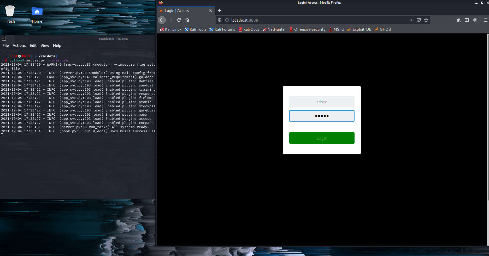

## Nota (Equipos)
Aquí podemos ver el inicio de sesión en el grupo del equipo rojo, el equipo rojo se identificará con una franja azul en la parte inferior de la página

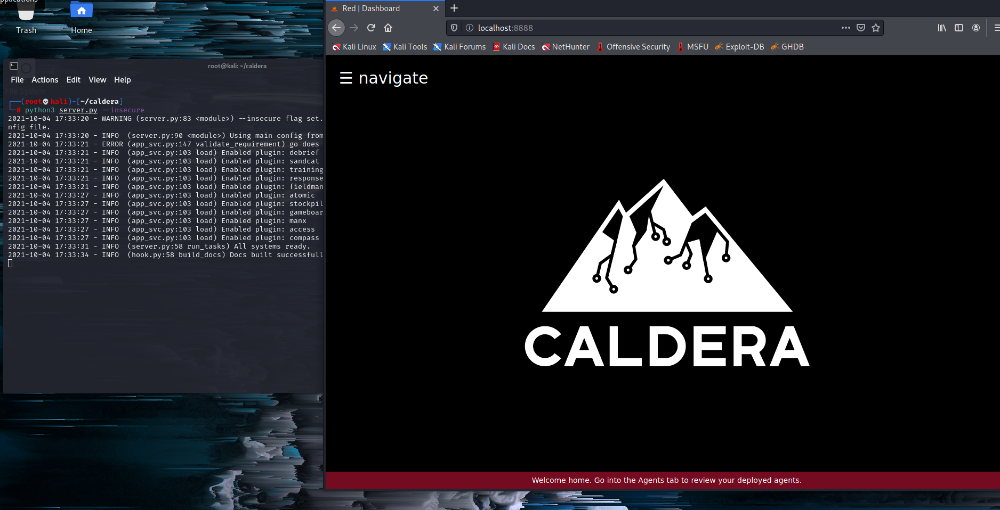

# 3. Como Ejecutar un agente

### Nota 1

Aquí tenemos el menú de opciones para empezar a trabajar con Caldera


### Paso 1 - Ir al menú de Agentes

En el menú de agentes podemos desplegar una aplicación que se ejecutará en segundo plano en la máquina que la coloquemos, y conectará automáticamente esa máquina a CALDERA.


### Paso 2 - Configuración del perfil de un agente

Para desplegar un agente existen varias opciones, pero *54ndc47* o *sancat* es la más utilizada para conectar máquinas a CALDERA.
Los pasos a seguir para desplegar un agente es elegir esta opción, elegir *sancat*, el sistema del equipo, copiar el comando que tenemos a continuación y pegarlo en la consola del sistema que queremos agregar a caldera.

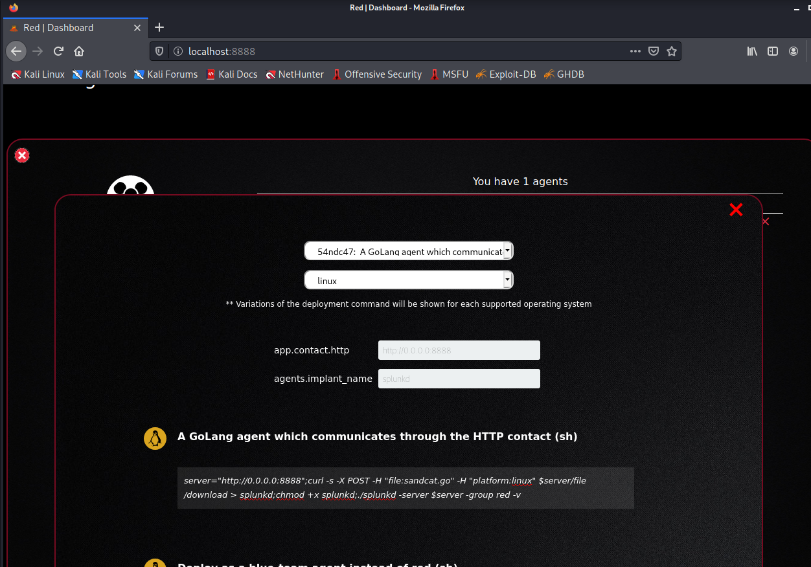

### Paso 3 - Copiar el Scrip

A continuación, se muestra un ejemplo de lo explicado anteriormente, una vez pegado presionamos enter y se ejecutará el proceso, luego lo minimizamos y continuamos.
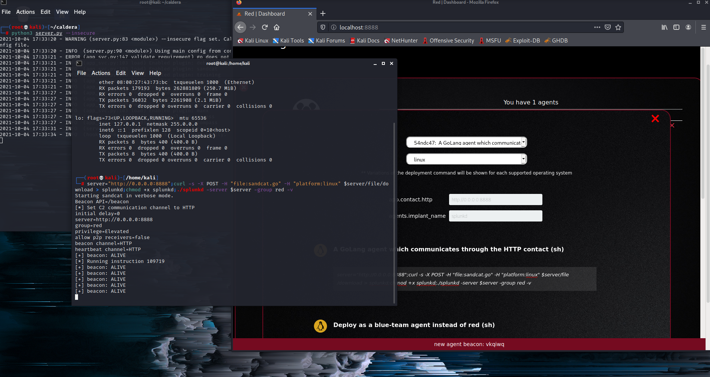

### Nota 2
Aquí podemos ver como la maquina ya está conectada de manera correcta en la consola de CALDERA

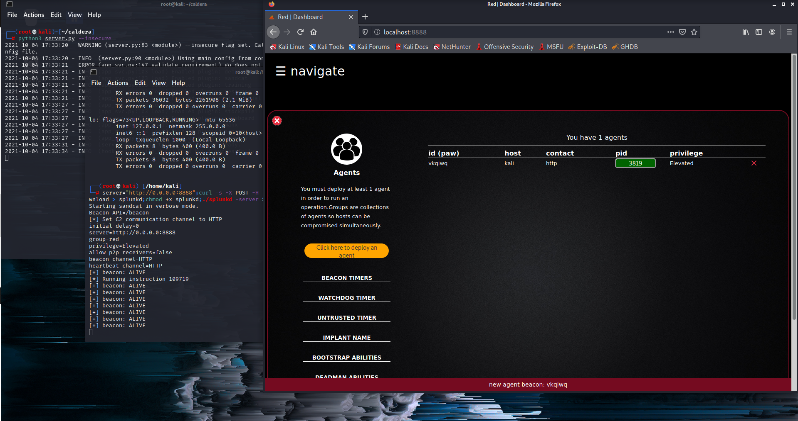

### Paso 4 - Ir Al menú de Entrenamiento
En la pestaña de entrenamiento podemos ver que podemos agregar nuestra máquina host y otras máquinas para ser examinadas también y para llevar a cabo este proceso debemos usar nuestras habilidades en el equipo rojo.


# 4. Como Ejecutar un agente**

### Paso 1 - Menú de Operaciones

En la pestaña de operaciones podemos elegir el tipo de ataque que queremos realizar en las máquinas que tenemos conectadas a CALDERA. Por ejemplo, podemos usar la opción *Operaciones*, para que podamos ver todos los archivos e información sensible que tiene la máquina.

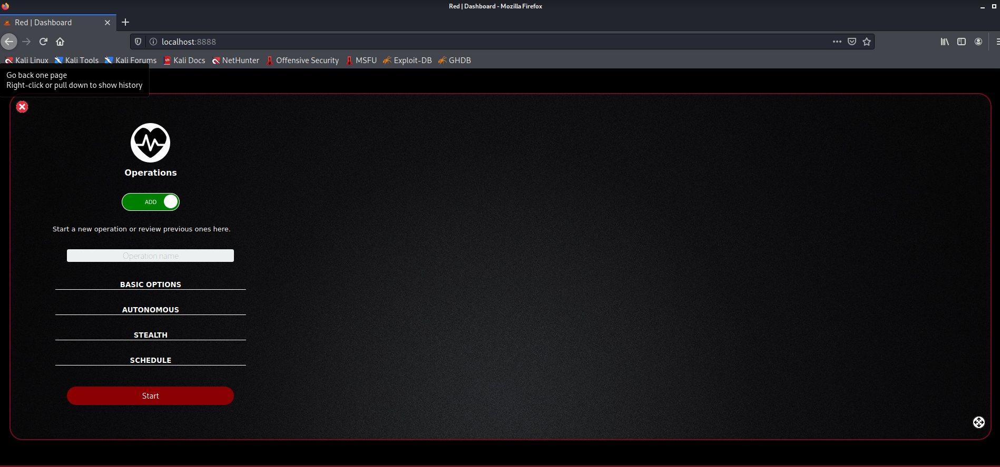

### Paso 2 - Creación de una Operación

Para iniciar una operación, primero debemos colar el nombre de esta, luego elegir si es a todos los usuarios o a la red de máquinas que tiene BOILER conectadas, luego elegimos el tipo de ataque que queremos realizar, todos y cada uno de estos se puede ver en la página de Mitre ATT&CK, y las otras opciones se pueden dejar por defecto


### Nota 1

Una vez configurados los pasos anteriores, presione inicio y automáticamente comenzará a realizar los procesos relacionados con el tipo de ataque. 
Por ejemplo, recopilación de información, escaneo de vulnerabilidades, verificación de versiones de los sistemas y programas, entre otros. al hacer clic en la estrella podemos ver la información recopilada.


### Paso 3 - Menú del perfil de adversario

En la pestaña de perfiles del adversario podemos ver los tipos de ataques y los procesos que realizan, en este menú podemos personalizar un ataque que queramos con las habilidades y características de varios ataques.


### Paso 4 - Ir al Menú Debrief

En la pestaña Debrief podemos seleccionar las operaciones que hemos realizado anteriormente y ver un mapa gráfico de los procesos que realizamos para ello.

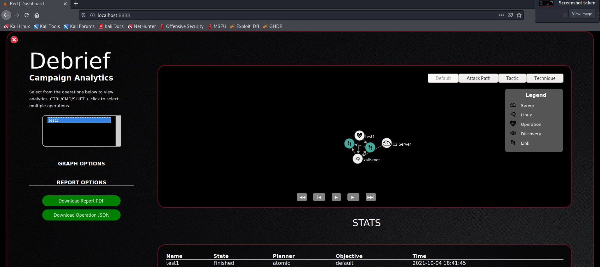

### Paso 5 - Ir Al Menú Compass

En CALDERA muchas veces no encontramos todos los ataques que podemos encontrar en la página de Mitre ATT&CK, y por eso si queremos aprovechar los ataques de uno de los grupos criminales o terroristas más afectivos, en la pestaña BRÚJULA podemos importar el ataque y cargarlo en CALDERA.

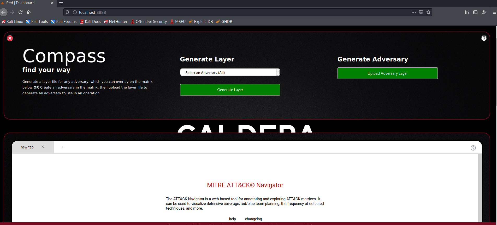

### Paso 6 - Descargar el tipo de Ataque

Primero debemos descargar el tipo de ataque que queremos, lo lograremos visitando la página de https://attack.mitre.org/ y seleccionamos Grupos

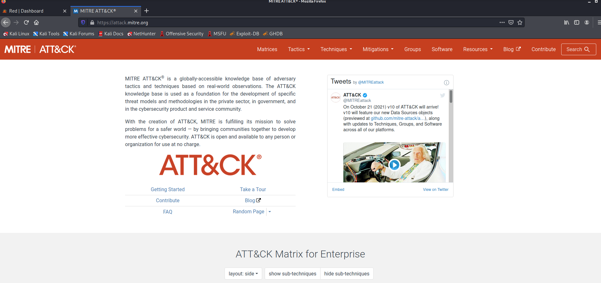

Luego hacemos clic en *Grupos* y seleccionamos *APT-1*

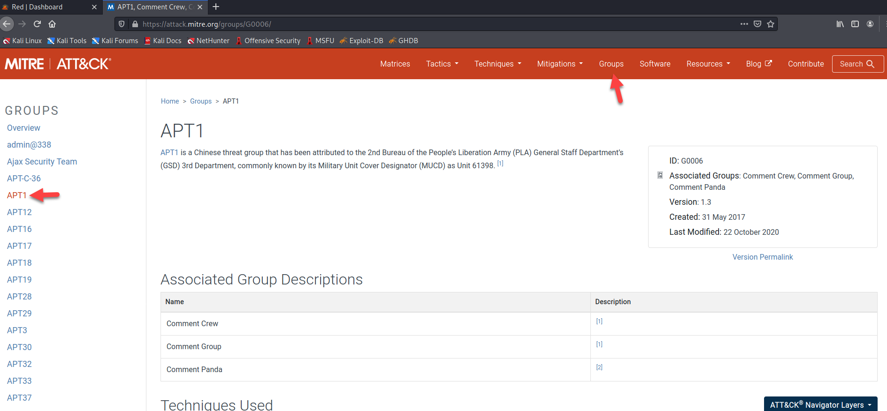

buscamos la pestaña de capas del navegador ATT&CK, desplegamos el menú de opciones y elegimos la opción de descargar, y luego OK.

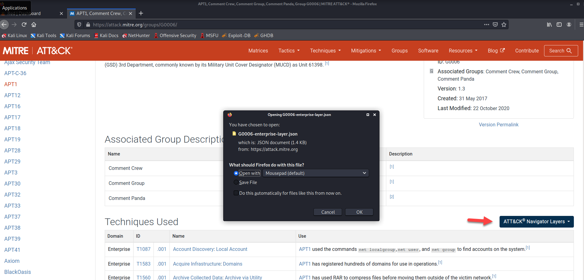

### Paso 7 - Cargar el Ataque

Una vez descargado damos en COMPASS para subir la capa adversaria, cargamos el archivo y se subirá automáticamente.

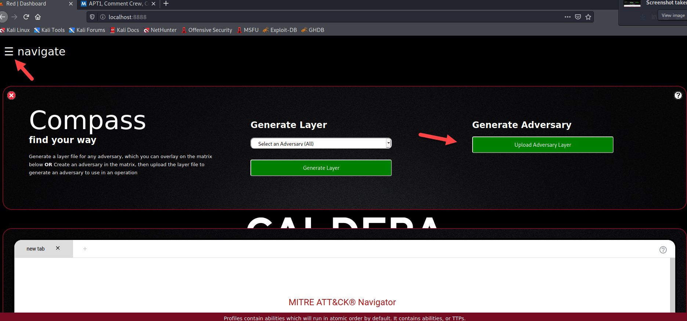

### Paso 8 - Buscar el Ataque

Si vamos al menú de perfil de adversarios, buscamos el ataque que hemos cargado y aparecerán todos los procesos que podemos realizar con él.


### Paso 9 - Seleccionar el Ataque

Podemos elegirlo para hacer una operación con el fin de comprometer a un equipo y obtener sus credenciales. Esto lo realizamos en el menú de operaciones.

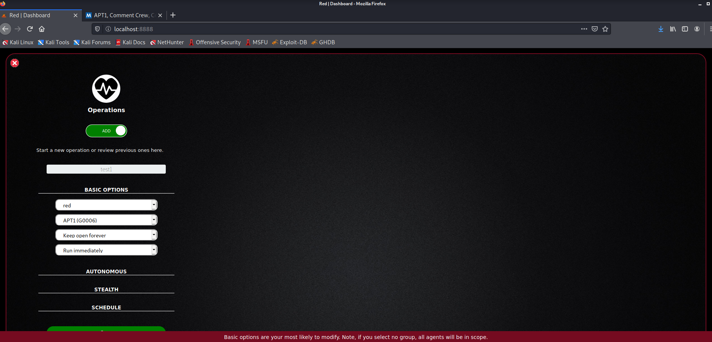

### Paso 10 - Iniciar el ataque y mirar los resultados

En nuestra operación hemos encontrado el archivo passwd, que es donde se almacenan las contraseñas en los sistemas Linux y aquí muestra una lista de las posibles contraseñas de nuestro sistema gracias a una de las operaciones de recolección del ataque realizado.

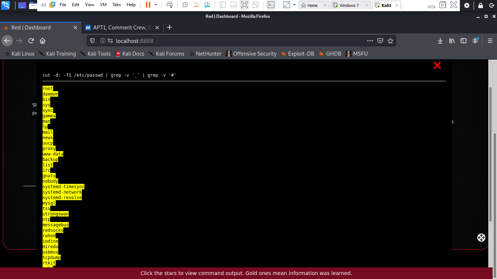

# 5. Material Adicional**

[CALDERA: Automating Adversary Emulation] https://www.youtube.com/watch?v=fx3635hLewg

[To Download CALDERA] https://github.com/mitre/caldera

[Documentation] https://caldera.readthedocs.io/en/latest/

[Documentation:] https://readthedocs.org/projects/caldera/

[SPONSOR TALK! Mitre's Caldera] https://youtu.be/YNIxwNLF7dc

[CALDERA: Automating Adversary Emulation] https://youtu.be/fx3635hLewg

======================================

*Preparado por Kevin Arauz*

*Redes sociales "Kevluxx"*

*Ultima actualización 10/10/21*

